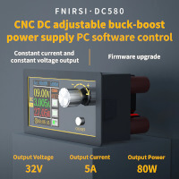
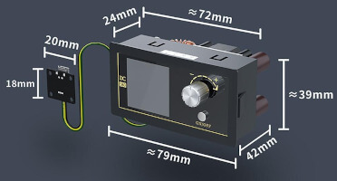

# FNIRSI DC-580 serial protocol

## Introduction

Hacked serial protocol for FNIRSI DC-580. See Python example, and below for frames decoding.

Also give a look at iordi's project. who is working on a Java GUI: https://github.com/iordic/jdcx/wiki/Serial-communication

## Product description

 

* DC buck / boost CC CV
* in:  8~32V
* out: 1.8~32V 5A 80A (resolution: 0.1V / 1mA)
* protection: OVP, OCP, OPP, OTP, OHP, reverse, backflow
* serial:
  * chip: QuinHeng CH341
  * settings: 115200 8N1 XON/XOFF

Remarks

* M1 / M2 buttons in the windows app match nothing in the documentation, or in the logs

## Serial protocol

### write

* sniffed from the Windows software - all commands have '\r\n' suffix (0x 0D 0A)
* commands might not be executed - a delay of 0.5s between commands seems better

| button / cell | hex  | ASCII   | comment                                                      |
| ------------- | ---- | ------- | ------------------------------------------------------------ |
| connect       | 51   | Q       | enable logs (MB log once, the short one) disable POWER button on screen |
| disconnect    | 57   | W       | stop logs enable POWER button on screen                 |
| voltage set   |      | V*xxxx* | U * 100 (ex. 5.0V => V*0500*)                                |
| current set   |      | I*xxxx* | I * 1000 (ex. 3.1A => I*3100*)                               |
| OVP           |      | B*xxxx* | U * 100 (ex. 5.0V => B*0500*)                                |
| OCP           |      | D*xxxx* | I * 1000 (ex. 3.1A => D*3100*)                               |
| OPP           |      | E*xxxx* | P * 10 (ex. 80W => E*0800*) warning: read is *100, write is *10 |
| OHP_H         |      | H*xx*   | ex. H01                                                      |
| OHP_M         |      | M*xx*   | ex. M02                                                      |
| OHP_S         |      | S*xx*   | ex. S03                                                      |
| OK            | 5A   | Z       | reset status flag (exits from protection)                    |
| enable        | 4E   | N       | switch ON                                                    |
| disable       | 46   | F       | switch OFF                                                   |
| M1            | 4F   | O       |                                                              |
| M2            | 50   | P       |                                                              |
|               |      | X       | enable time protection                                       |
|               |      | Y       | disable time protection                                      |

### read

* ASCII content, separated by « A » character
* there is no header of footer on the log, except « MB » after « connect »
* log is sent ~2x/s

ex. MB**0499**A**0104**A**0051**A**0**A**028**A**0**A**0**A**0500**A**3000**A**3500**A**5100**A**8000**A**0**A**01**A**02**A**03**A**1**A

ex. **0499**A**0104**A**0051**A**0**A**028**A**0**A**0**A

| index | description            | metric  | example | value                                            |
| ----- | ---------------------- | ------- | ------- | ------------------------------------------------ |
| 0     | voltage (*100)         | V       | 0499    | 4.99 V                                           |
| 1     | current (*100)         | A       | 0104    | 1.04 A                                           |
| 2     | power (*100)           | W       | 0051    | 0.51 W                                           |
| 3     |                        |         | 0       |                                                  |
| 4     | temperature            | °C / °F | 028     | 28 °C                                            |
| 5     | CV / CC                | bool    | 0       | 0: CV, 1: CC                                     |
| 6     | protection             | int     | 0       | 0: OK, 1: OVP, 2: OCP, 3: OPP, 4: OTP, 5: OHP    |
| 7     | voltage target (*100)  | V       | 0500    | 5.00 V                                           |
| 8     | current target (*1000) | A       | 3000    | 3.00 A                                           |
| 9     | OVP (*100)             | V       | 3500    | 35.00 V                                          |
| 10    | OCP (*1000)            | A       | 5100    | 5.10 A                                           |
| 11    | OPP (*100)             | W       | 8000    | 80.00 W warning: read is *100, write is *10 |
| 12    | OHP enable             | bool    | 0       | False (OFF)                                      |
| 13    | OHP hours              | hours   | 01      | 1h                                               |
| 14    | OHP minutes            | minutes | 02      | 2m                                               |
| 15    | OHP seconds            | seconds | 03      | 3s                                               |
| 16    | enable                 | bool    | 1       | True (ON)                                        |

## References

* http://www.fnirsi.cn/productinfo/481353.html
* https://www.aliexpress.com/item/4000424191711.html?spm=a2g0s.9042311.0.0.27424c4dKSFzAb
* https://github.com/iordic/jdcx/wiki/Serial-communication

